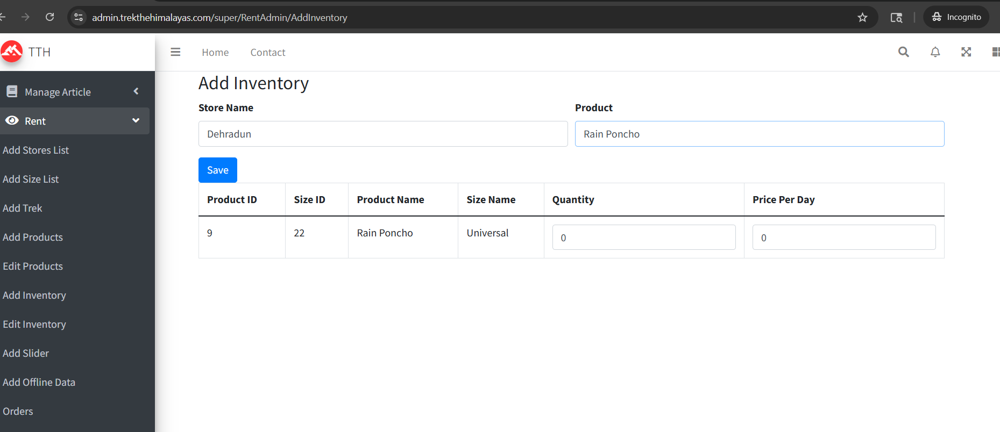
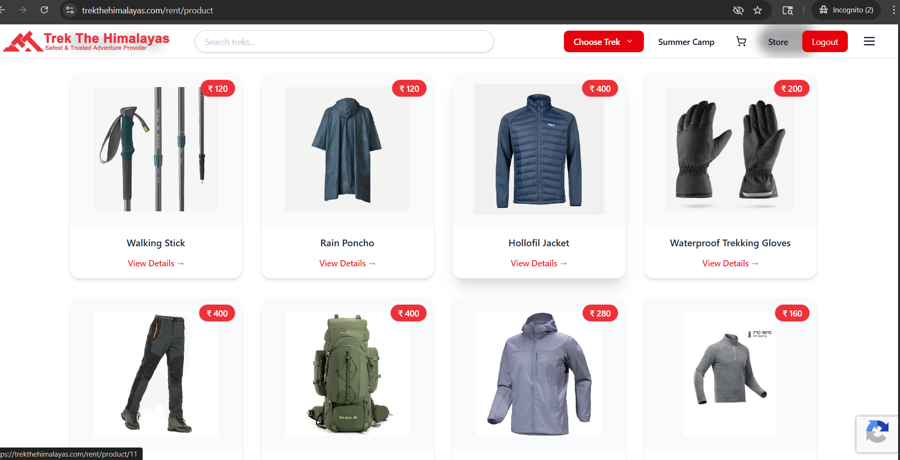
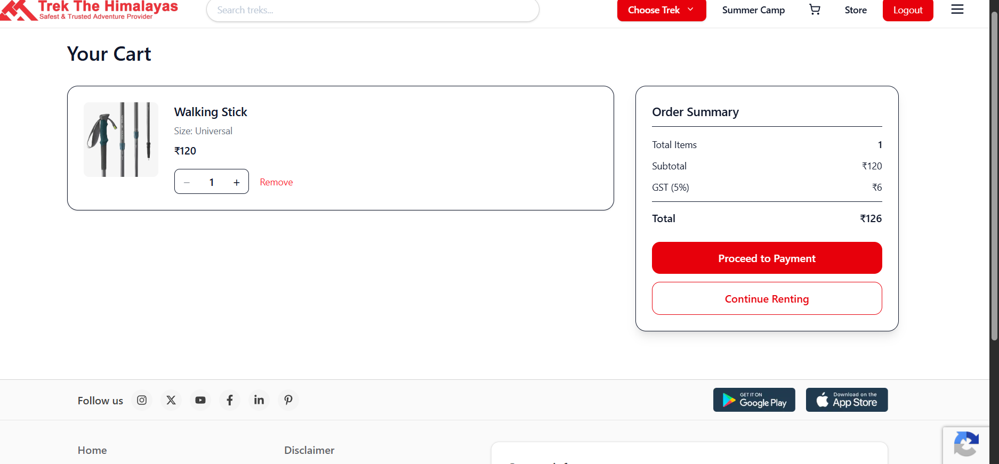
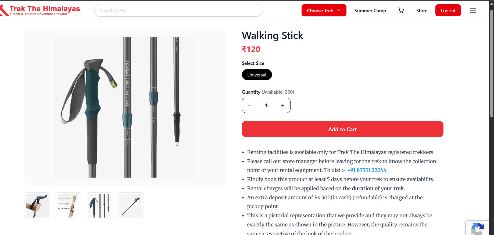
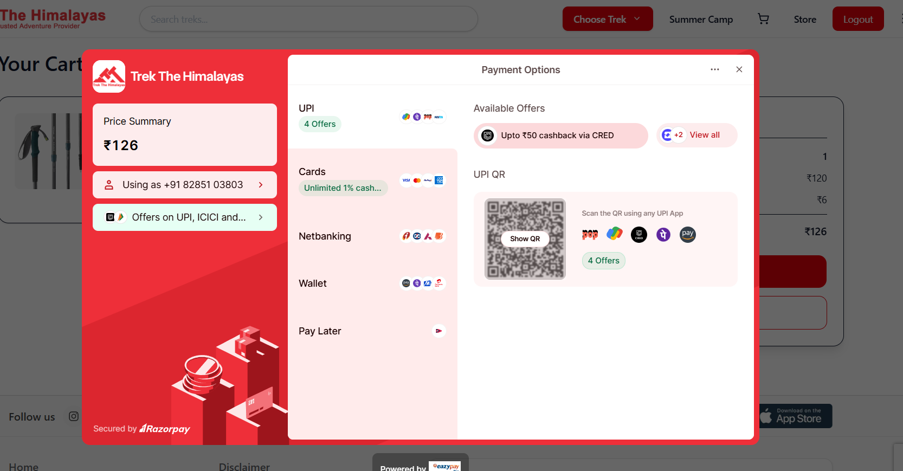

# Trek Rental & Inventory Management System

## 📌 Overview

This project is a module of a Trek Rental System developed using ASP.NET MVC.
It includes both Admin Panel and User Panel functionalities for managing and renting trekking gear.

---

## 🚀 Features

### 🔧 Admin Panel

* Add/Edit Products
* Inventory Management
* Store Management
* Order Handling
* Rent Slider Management

### 👤 User Panel

* Browse rental products
* View product details
* Add to cart
* Checkout flow
* Payment handling

---

## 🔌 Backend API Development

I developed RESTful APIs using ASP.NET Core Web API to handle core business logic and support application functionality.

### 📌 API Responsibilities

* Fetch rental products data
* Provide product details
* Manage cart operations
* Handle booking and order creation
* Process payment requests
* Update inventory after successful transactions

---

### 🔗 Sample Endpoints

* GET /api/RentApi/get-all-products
* GET /api/RentApi/get-product-details/{id}
* POST /api/RentApi/add-to-cart
* POST /api/RentApi/check-quantity-availability
* POST /api/RentApi/handle-payment-success

---

### 🌐 Live API Example

https://api.trekthehimalayas.com/api/RentApi/get-all-products/66/7808

⚠️ Note:
This API is secured and will not return data without a valid JWT token and proper trek booking.

---

### 🔐 Authentication

Most APIs are secured using JWT Authentication.

Add the following header:
Authorization: Bearer <## 🔌 Backend API Development

I developed RESTful APIs using ASP.NET Core Web API to handle core business logic and support application functionality.

### 📌 API Responsibilities

* Fetch rental products data
* Provide product details
* Manage cart operations
* Handle booking and order creation
* Process payment requests
* Update inventory after successful transactions

---

### 🧪 API Testing

APIs were tested using Postman with live server integration.

---

### 🧪 API Testing

APIs were tested using Postman with live server integration.

---

## 🧠 My Contribution

* Developed Rent Cart functionality
* Implemented Booking ID generation logic
* Managed inventory updates after payment
* Built Admin Panel operations (Add/Edit Products, Inventory)
* Developed backend APIs for cart, booking, and payment
* Worked on User Panel product flow

---

## 🛠 Tech Stack

* ASP.NET MVC
* ASP.NET Core Web API
* C#
* SQL Server
* Bootstrap
* JavaScript

---

## 📂 Project Structure

* RentModule → Admin Panel logic
* UserPanel → User-facing features
* Controllers → Handles requests
* Entities → Database tables
* Models → ViewModels & DTOs
* Repository → Data access layer
* Views → UI components

---

## ⚠️ Note

This is a partial module from a team project. Only my contribution has been uploaded.
APIs require proper authentication and database setup to run locally.

---

## 📸 Screenshots

### Admin Panel

### Product Listing

### Cart Page

### Product Details

### Payment

